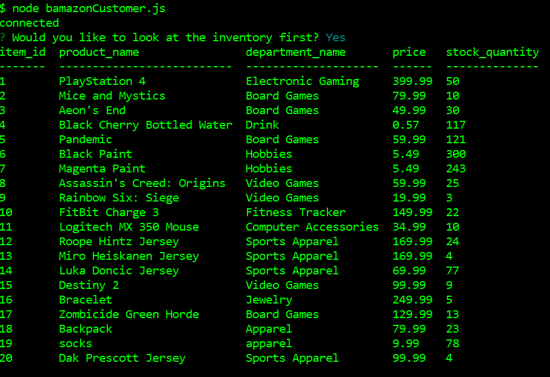

# Bamazon

## Purpose

The purpose of this project is to combine node with a mySQL server.  This allows the mySQL server to update in real time as a user inputs information into the console without actually looking at the server itself.

## Creating the Database

Before running anything else, make sure that you run the seed, bamazon_seed.sql in the mySQL application so that the database is created.

This will create your initial table that the database will run.

## Bamazon Customer

The first part of the app is the customer side of the application.  Starting with the opening menu of whether or not a customer needs to see the inventory.

Choosing the first option of "Yes" displays the current inventory state.

After looking at the inventory, the customer is prompted for what item they would like to purchase by item_id as each product has their own unique item_id.

In this case, the user is short on socks, so they needed to purchase a lot and it tells them the total cost of their socks at the end.

Sometimes, we fat finger our keyboard, or just don't read directions.  In that case, we inform the customer that we must use numbers in order to advance.

Once you're done shopping, when it asks if you want to continue shopping, you choose the "No" option and it will close the connection.

## Bamazon Manager

The Bamazon Manager portion is slightly more involved as there are 4 different parts that it can do:
1. Look at the inventory
1. Look at the low inventory (anything that has an inventory quantity of less than 5)
1. Add to the inventory (by item_id)
1. Add a new product to the inventory